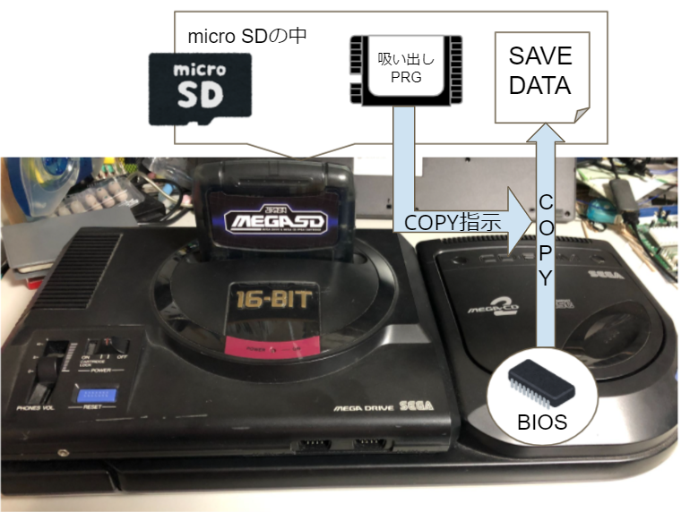
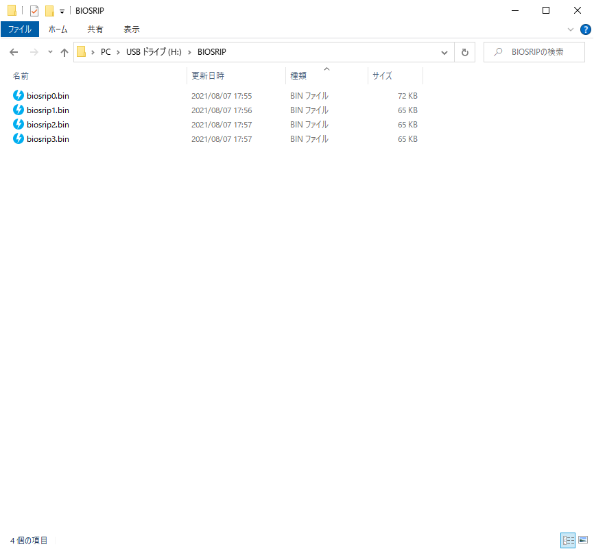
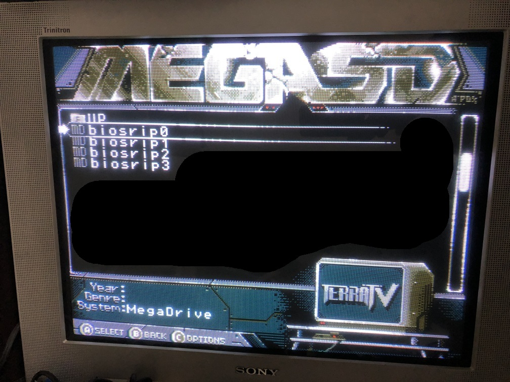
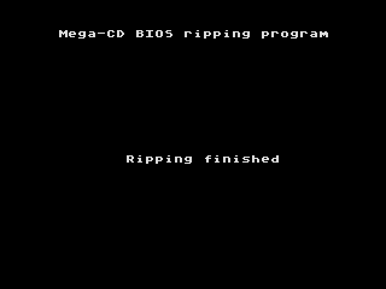
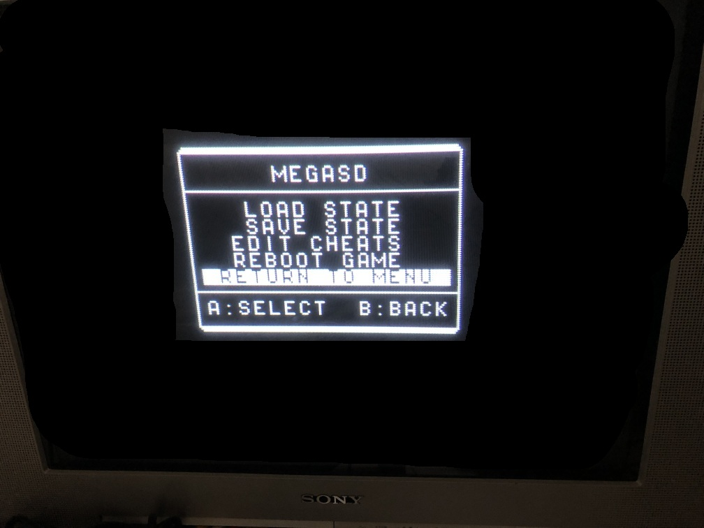
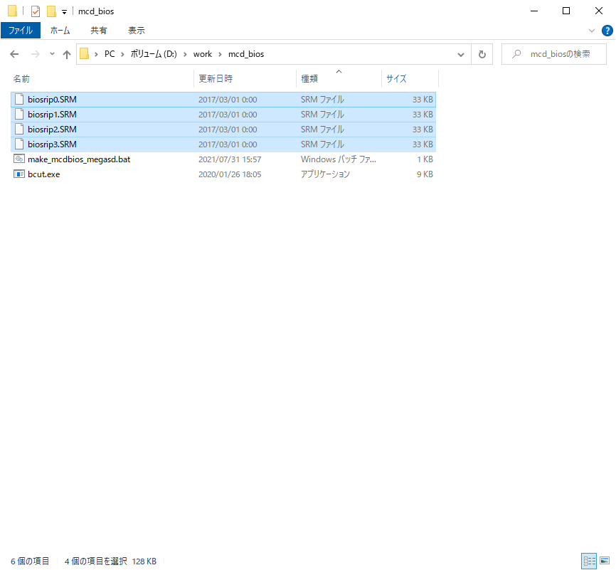
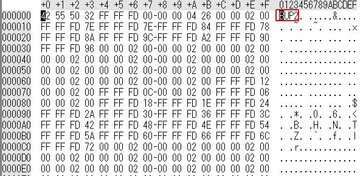

Click [here](/README_en.md) for the English README  

# MegaCD BIOS Ripper for MegaSD

MegaSDに入れて使用するとセーブデータとしてメガCDのBIOSを吸い出せるメガドラROMソフトのイメージです。  
なお、BIOSが128KBに対してセーブデータの最大サイズが32KBのため、4回に分けて保存してから後で結合する必要があります。  



## 準備するもの

- [MegaSD](https://terraonion.com/en/producto/megasd/)
- メガドライブ（1 or 2）
- メガCD（1 or 2） ※  
※ CDドライブは動作しなくてもよいが、BIOS起動まではできること

## 使い方

1. MegaSDのSDカードの適当な場所にbiosrip0～3.binを入れる  
  
2. MegaSDをメガドライブに挿し、メガCDはメガドライブに接続した状態で起動  
（吸い出しが終わって普段MEGASDを使う際には、メガCDは外して運用します）  
3. biosrip0～3.binを全て実行  
  
「Ripping finished」と出たら終了です。  
  
MegaSDでIn-Game Menuの設定をONにしてあれば、↑＋STARTでメニュー画面を呼び出してメインメニューに戻ることが出来るので、少しだけ作業が楽になります。  
  
4. MegaSDからマイクロSDを取り出し、BUPフォルダ内にあるセーブデータ(biosrip0～3.SRM)を結合  
windowsの場合には、同梱しているmake_mcdbios_megasdに移動しbatを実行します。  
  
それ以外の場合には.SRMファイルのヘッダ4Byte("BUP2")を削ってから4ファイルを連結します。  
  
5. 結合したファイル（mcd_bios.bin）がリッピングされたBIOSファイルです。お疲れさまでした。  

## 本ソフトについて

元々ブログ「[発明の友](http://blog.livedoor.jp/scrap_a/)」にて公開していたものです。他にもバックアップRAMカートリッジを用いた吸い出しも公開しています。

- [メガCDのBIOS吸い出し方法まとめ＆MEGASDを使ったBIOS吸い出し](http://blog.livedoor.jp/scrap_a/archives/28094899.html)
- [バックアップRAMカートリッジを使ってメガCDのBIOSを吸い出し](http://blog.livedoor.jp/scrap_a/archives/24228164.html)

## ビルド方法

本ソフトは、メガドライブのオープンソース開発環境である[SGDK](https://github.com/Stephane-D/SGDK)を使用させて頂いています。

make.batを実行すると出力されるout/rom.binがメガドライブで実行するファイルです。biosrip0.binとリネームしてください。

次にmain.cのbank変数を1に変更してビルドし直し、出力をbiosrip1.binにリネームします。

```c
int bank=0;     //bank select [0-3]
```

以降、bank=2,3も同様に実行して得られるbiosrip0～3.binがメガドライブ上で実行するファイルです。

## ライセンス

ライセンスはMITライセンスに従っています。licenseディレクトリのLICENSEを参照ください。
また、make.batおよびsrc内のファイルは[SGDK](https://github.com/Stephane-D/SGDK)のファイルを一部あるいは全て使用しています。SGDKのライセンスはlicenseディレクトリのlicense.txtを参照ください。

## 備考（詳しい方向け）

H-INTレジスタの値でハードウェア的に上書きされる$72-73は、BIOS本来の値である0xFD0Cになるように修正しています。
