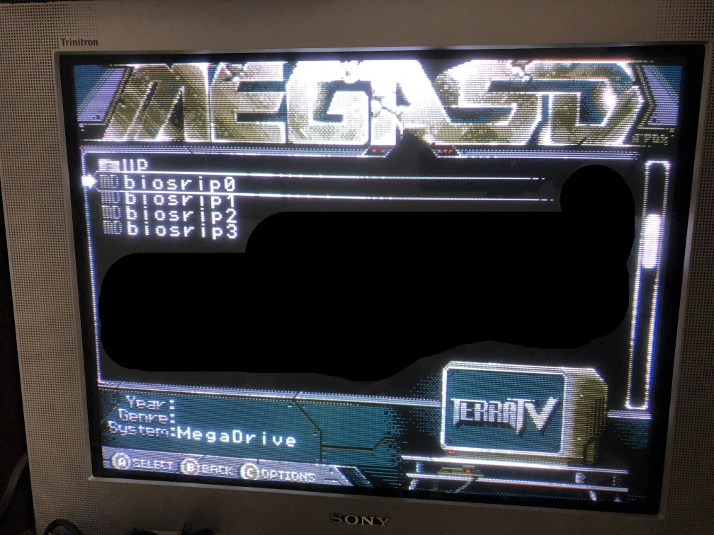
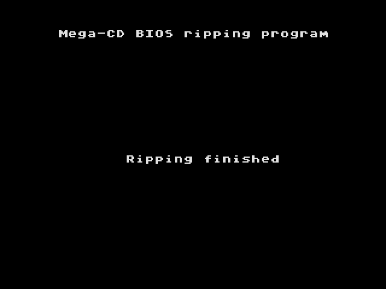
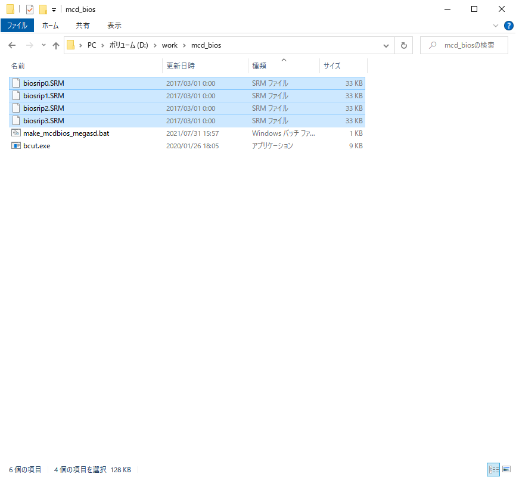

日本語のREADMEは[こちら](/)  

# MegaCD BIOS Ripper for MegaSD

This is a Mega Drive ROM image that, when used with the MegaSD, can extract the MegaCD (known as SegaCD in some regions) BIOS as save data.  
Since the BIOS is 128KB while the maximum save data size is 32KB, it needs to be saved in four parts and later combined.  


## What You’ll Need

- [MegaSD](https://terraonion.com/en/producto/megasd/)
- Mega Drive (1 or 2)
- MegaCD (1 or 2) ※  
※ The CD drive doesn’t need to function, but the system must be able to boot up to the BIOS.

## How to Use

1. Place `biosrip0-3.bin` in any location on the MegaSD’s SD card.  
  
2. Insert the MegaSD into the Mega Drive and start it with the MegaCD connected.  
(Once the ripping is complete and you’re using the MegaSD normally, you can disconnect the MegaCD.)  
3. Run all of `biosrip0-3.bin`.  
  
When “Ripping finished” appears, the process is complete.  
  
If the In-Game Menu setting is turned ON in the MegaSD, you can press ↑ + START to bring up the menu screen and return to the main menu, making the process slightly easier.  
  
4. Remove the microSD from the MegaSD and combine the save data (`biosrip0-3.SRM`) found in the BUP folder.  
For Windows, move to the included `make_mcdbios_megasd` folder and run the `.bat` file.  
  
For other systems, remove the 4-byte header ("BUP2") from the `.SRM` files and concatenate the four files.  
  
5. The combined file (`mcd_bios.bin`) is the ripped BIOS file. That’s it—you’re done!  

## About This Software

This software was originally published on the blog “[発明の友](http://blog.livedoor.jp/scrap_a/)”(available in Japanese only). It also includes a method for extracting the BIOS using a backup RAM cartridge.  

- [メガCDのBIOS吸い出し方法まとめ＆MEGASDを使ったBIOS吸い出し](http://blog.livedoor.jp/scrap_a/archives/28094899.html)  
- [バックアップRAMカートリッジを使ってメガCDのBIOSを吸い出し](http://blog.livedoor.jp/scrap_a/archives/24228164.html)

## How to Build

This software utilizes the open-source Mega Drive development environment [SGDK](https://github.com/Stephane-D/SGDK).

Running `make.bat` will output `out/rom.bin`, which is the file to be executed on the Mega Drive. Rename it to `biosrip0.bin`.

Next, change the `bank` variable in `main.c` to 1, rebuild, and rename the output to `biosrip1.bin`.

```c
int bank=0;     // bank select [0-3]
```

Repeat the process for bank=2 and bank=3 to obtain biosrip0-3.bin, which are the files to be executed on the Mega Drive.

## License

This software follows the MIT License. Refer to LICENSE in the license directory for details.
Additionally, make.bat and files in the src directory use some or all of the files from SGDK. Refer to license.txt in the license directory for SGDK’s license.

## Notes (For Advanced Users)

The values at $72-73, which are overwritten by hardware via the H-INT register, have been corrected to match the original BIOS value of 0xFD0C.
